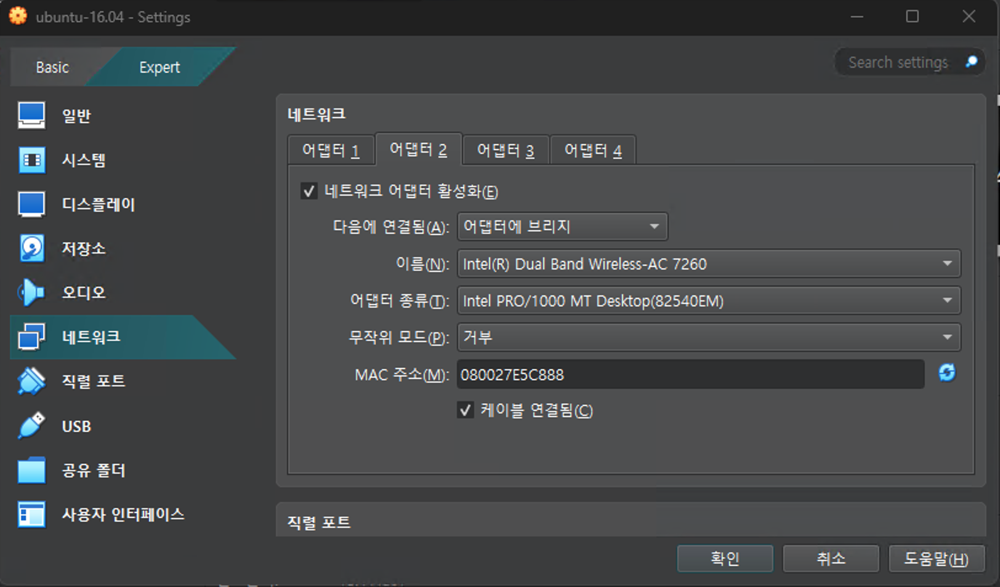

# Ubuntu Desktop on VirtualBox 7.1.4

## VirtualBox Install

## Virtual Machine 등록: import image

### 1. VB를 실행한다

### 2. `파일` menu -> `가상시스템 가져오기`를 선택한다

### 3. `가상시스템 가져오기` 창에서 다음을 진행한다

* `원본`세션에서 배포된 `.ova` 파일 (예:`ubuntu-16.04_190622a.ova`)를 선택
* `설정`세션에서 `MAC 주소 정책`을 `모든 네트웍 어뎁터에 새 MAC 주소 생성` 을 선택
* `완료`를 선택하고 진행

### 4. import한 가상 시스템 setting

`가상시스템`을 선택하고 아래 항의 설정을 수정하자

* `시스템`항
  * `기본 메모리`: 2048
  * `프로세서`: 2
  * `확장된 기능`-> `I/O APIC 활성화`: 선택 (프로세서 2개로 선택시 발생한 warning에 대한 조치)
* `디스플레이` 항
  * `그래픽 컨트롤러`: `VMSVGA` 선택
* `네트웍크` 항
  * `어뎁터2`추가: `어뎁터에 브리지`

* `공유폴더` 항
  * host system의 공유 폴더 추가: `C:\linux\share`

